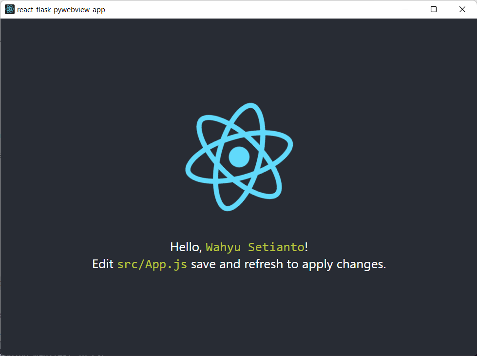

# Test Application for `PyWebView` library



**Goals** : Build an app using `PyWebView` using `react` for the frontend and `flask`
to handle the backend.

## Run on local

Run the app on your local system. Clone this repo and run this commands on your terminal

```bash
yarn run init
```

that will install all dependencies to run the app.

**Start the Application**

On your terminal run this command to watch your react application

```bash
yarn dev
```

Open up new terminal and run this command to start the app

```bash
yarn start
```

**Build the Application**

Build the application using this command

```bash
yarn build
```
