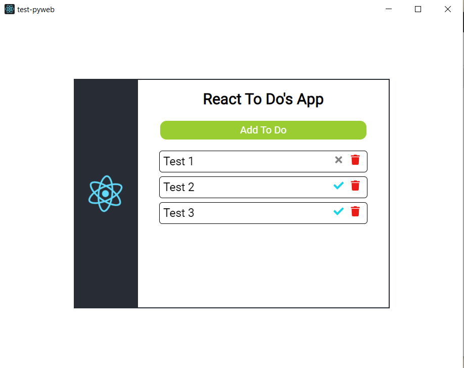

# Test Application for `PyWebView` library
<p align="center">
  
</p>

**Goals** : Build ToDos App using `react` for the frontend and `flask` to 
handle the backend.

### React ToDos App

ToDos App is build / production app from the 
[learn-frontend](https://github.com/Hyuto/learn-frontend) repository.

## Run on local

Run the app on your local system. Clone this repo, setup `venv`, and install 
requirements for this project.

Run **App**

```
python main.py
```

## Build into Executable

For linux and windows only

```bash
pyinstaller main.spec
```