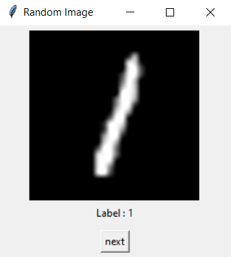

# MNIST using Pytorch

Create an application to make a model for classifying digits using plain Pytorch

## Dataset

Yann LeCun ~ [MNIST DATABASE of handwritten digits](http://yann.lecun.com/exdb/mnist/index.html)

**Description**

* 60k training images 
* 10 testing images
* 28 x 28 pixel image shape
* grayscale
  
**View data randomly**

Using `data.py` script.

<p align="center">
  
</p>

**randomly view train dataset**

```bash
python data.py -rs train
```